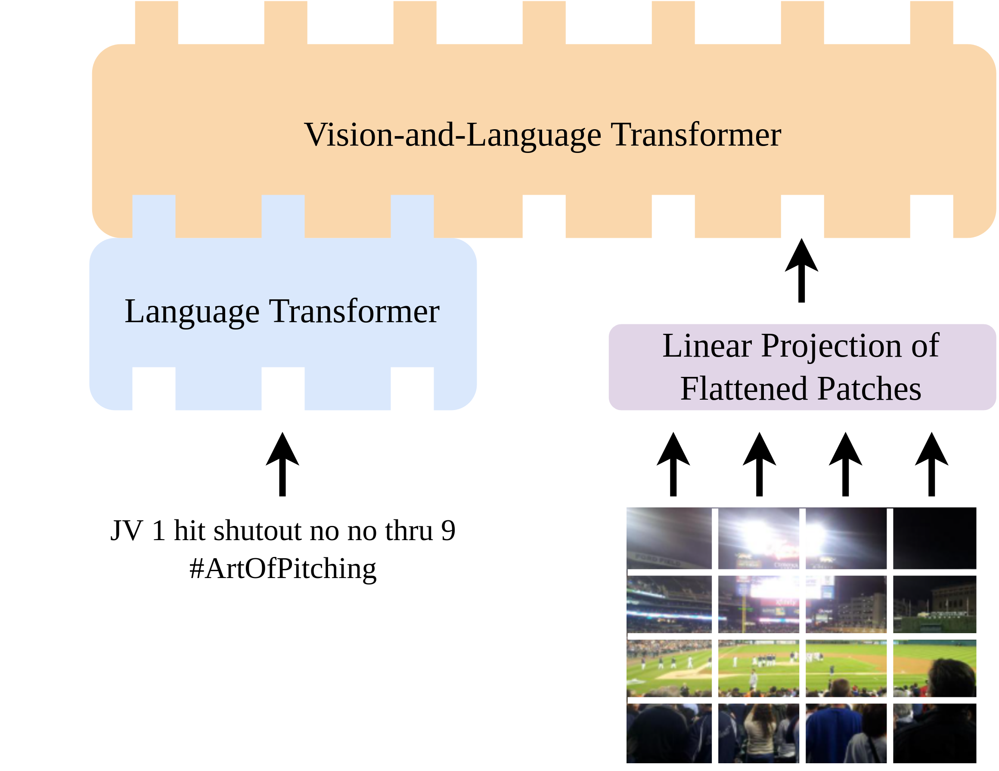

# VAuLT: Vision-and-Augmented-Language Transformer

Code for [VAuLT: Augmenting the Vision-and-Language Transformer For Sentiment Classification on Social Media](https://arxiv.org/abs/2208.09021).



---

## Installation


Experiments were conducted with `Python 3.7.4`. To install the necessary packages (preferably in a virtual environment):

```bash
pip install -e .
```

If you want to alter the implementation, we suggest you install with:

```bash
pip install -e .[dev]
```

(Note to zsh users: escape `[` and `]`).

### Entity Linking

While our experiments showed no improvement from the implemented form of entity linking, you can use it for the `TWITTER-1#` datasets by following [these instructions](https://github.com/informagi/REL#setup-package) (we install their package using `pip` in `setup.py`, aka the above commands) and enabling it when running the scripts.

---

## Using VAuLT

```python
from vault.models.vault import VaultModel, VaultProcessor
import requests
from PIL import Image

vilt_model_name_or_path = "dandelin/vilt-b32-mlm"
bert_model_name_or_path = "vinai/bertweet-base"

processor = VaultProcessor.from_pretrained(
    vilt_model_name_or_path, bert_model_name_or_path
)
model = VaultModel.from_pretrained(
    vilt_model_name_or_path,
    bert_model_name_or_path
    use_vilt_position_embeddings=False,
)

url = "http://images.cocodataset.org/val2017/000000039769.jpg"
image = Image.open(requests.get(url, stream=True).raw)
text = "a bunch of [MASK] laying on a [MASK]."

encoding = processor(image, text, return_tensors="pt")
outputs = model(**encoding)
outputs.keys()  # odict_keys(['last_hidden_state', 'pooler_output'])
```


---

## Datasets

### `TWITTER-1#`

Follow the instructions [here](https://github.com/jefferyYu/TomBERT). We expect the final structure of the dataset to be:

```
/data/twitter-tmsc/
├──twitter2015
│  ├── dev.tsv
│  ├── dev.txt
│  ├── test.tsv
│  ├── test.txt
│  ├── train.tsv
│  └── train.txt
├──twitter2015_images
│  ├── 996.jpg
│  ├── 997.jpg
│  ├── 998.jpg
│  ├── ...
│  └── 123456789.jpg
├──twitter
│  ├── dev.tsv
.  .
.  .
.  .
```

but the dataset configuration is configurable within the code (not the given scripts).

### `MVSA`

Find the links [here](https://mcrlab.net/research/mvsa-sentiment-analysis-on-multi-view-social-data/). We expect the final structure of the dataset to be:

```
/data/mvsa/
├── MVSA
│   ├── corrupt_ids.txt
│   ├── data
│   │   ├── 10000.jpg
│   │   ├── 10000.txt
│   │   ├── 10001.jpg
│   │   ├── 10001.txt
│   │   ├── 10002.jpg
│   │   ├── 10002.txt
│   │   ├── ...
│   │   └── 9998.txt
│   └── labelResultAll.txt
└── MVSA_Single
    ├── data
    │   ├── 1000.jpg
    │   ├── 1000.txt
    │   ├── 1001.jpg
    │   ├── 1001.txt
    │   ├── 1002.jpg
    │   ├── 1002.txt
    │   ├── ...
    │   └── 9.txt
    └──  labelResultAll.txt
```

where `corrupt_ids.txt` contains `3151`, `3910` and `5995` in separate lines.

### `Bloomberg`

Download annotations and text [here](https://github.com/danielpreotiuc/text-image-relationship) and the images [here](https://www.dropbox.com/s/olkxuw8b9cy9i0q/Twitter_images.zip?dl=0) (based on [this](https://github.com/danielpreotiuc/text-image-relationship/issues/2)). We expect the final structure of the dataset to be:

```
/data/bloomberg-twitter-text-image/
├── bloomberg-textimage.csv
└── Twitter_images
    ├── T1011681837276639236.jpg
    ├── T1011685052982415360.jpg
    ├── T1011695871761833987.jpg
    ├── T1011697874470653952.jpg
    ├── T1011698048647360512.jpg
    ├── T1011699257290739713.jpg
    ├── T1011700728883220482.jpg
    ├── ...
```

---

## Running the scripts

To replicate all existing results, run:

```bash
chmod +x /scripts/*

./scripts/test-results.sh -t /data/twitter-tmsc -b /data/bloomberg-twitter-text-image -m /data/mvsa -c 0 -r 5

./scripts/frozen-lms.sh -t /data/twitter-tmsc -b /data/bloomberg-twitter-text-image -c 0 -r 5

./scripts/toms.sh -t /data/twitter-tmsc -c 0 -r 5
```

The dataset directories are given based on the directory structures above, and you can change the device (`-c`) or the number of repetitions (`-r`) to your liking.

The final metrics will be available at `./experiment_logs` under subfolders with descriptive names, e.g.

```
experiment_logs/
├── TomBERTTMSC
│   ├── None,twitter2015(train),bert-base-uncased,False_0
│   └── None,twitter(train),bert-base-uncased,False_0
├── TomViLTTMSC
│   ├── twitter2015(train),bert-base-uncased,vilt-b32-mlm,False_0
│   ├── twitter2015(train),bert-base-uncased,vilt-b32-mlm,False_1
│   ├── twitter(train),bert-base-uncased,vilt-b32-mlm,False_0
│   └── twitter(train),bert-base-uncased,vilt-b32-mlm,False_1
├── VaultTMSCBloomberg
│   ├── bert-base-uncased,bloomberg-twitter-text-image(train;dev),vilt-b32-mlm_0
│   ├── bert-base-uncased,bloomberg-twitter-text-image(train;dev),vilt-b32-mlm_1
│   ├── bertweet-base,bloomberg-twitter-text-image(train;dev),vilt-b32-mlm_0
│   ├── bertweet-base,bloomberg-twitter-text-image(train;dev),vilt-b32-mlm_1
│   └── None,bloomberg-twitter-text-image(train;dev),vilt-b32-mlm_1
├── VaultTMSCMVSA
│   ├── bert-base-uncased,MVSA_Single(train;dev),vilt-b32-mlm_0
│   ├── bert-base-uncased,MVSA(train;dev),vilt-b32-mlm_0
│   ├── bertweet-base,MVSA_Single(train;dev),vilt-b32-mlm_0
│   ├── bertweet-base,MVSA(train;dev),vilt-b32-mlm_0
│   ├── None,MVSA_Single(train;dev),vilt-b32-mlm_0
│   └── None,MVSA(train;dev),vilt-b32-mlm_0
└── VaultTMSCTwitter201X
    ├── bert-base-uncased,twitter2015(train;dev),vilt-b32-mlm,False_0
    ├── bert-base-uncased,twitter2017(train;dev),vilt-b32-mlm,False_0
    ├── bertweet-base,twitter2015(train;dev),vilt-b32-mlm,False_0
    ├── bertweet-base,twitter2015(train;dev),vilt-b32-mlm,False_1
    ├── bertweet-base,twitter(train;dev),vilt-b32-mlm,False_0
    ├── bertweet-base,twitter(train;dev),vilt-b32-mlm,False_1
    ├── None,twitter2015(train;dev),vilt-b32-mlm,False_0
    └── None,twitter(train;dev),vilt-b32-mlm,False_0
```

The name of each specific experiment subfolder contains some important information like which models were used, which splits, etc. The final integer is used to differentiate runs with different hyperparameters if they do not appear in the main name (the same experiment ran twice will log additional experiments in the same subfolder). Each of the above "leaf" subfolders will look like:

```
experiment_logs/VaultTMSCTwitter201X/bert-base-uncased,twitter2015(train;dev),vilt-b32-mlm,False_0/
├── aggregated_metrics.yml
├── metrics.yml
├── obj.pkl
├── params.yml
└── plots
    └── train_loss.png
```

`aggregated_metrics.yml` contains the mean and the standard deviation of all logged metrics across multiple runs for the epoch designated as the final one (e.g. simple training will use the last epoch, early stopping will use the corresponding step, see example below), `metrics.yml` contains all the logged metrics, `params.yml` contains the hyperparameter configuration, `plots` contains plots of the metrics that are logged across all training (not final metrics, e.g. those of the test set), and `obj.pkl` contains the logger object, which you can re-load by using the `load_existent` method of `vault.logging_utils.ExperimentHandler`.

```
? ''
: best_train_loss: 0.0016+-0.0002
  test_eval_accuracy: 0.7563+-0.0084
  test_eval_loss: 1.5356+-0.0650
  test_macro_f1_score: 0.6997+-0.0171

```
